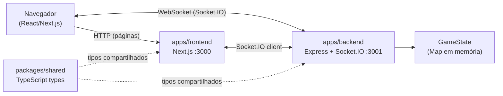

# Phase 9: Documentação do projeto - Research

**Pesquisado:** 2026-04-13
**Domínio:** Documentação técnica (README, docs/, Mermaid, deploy Railway+Vercel)
**Confiança:** HIGH

---

<user_constraints>
## User Constraints (from CONTEXT.md)

### Locked Decisions

- **D-01:** README.md na raiz — visão geral, badges, links rápidos para docs
- **D-02:** Pasta `docs/` com: INSTALL.md, ARCHITECTURE.md, CONTRIBUTING.md, DEPLOY.md
- **D-03:** `.env.example` já documentado — referenciar, não duplicar
- **D-04:** Toda documentação em **PT-BR**
- **D-05:** Instalação passo a passo detalhada — sem assumir conhecimento prévio além de terminal
- **D-06:** Cobrir: requisitos, clone, `npm install`, `.env`, `npm run dev`, `npm run test`, `npm run typecheck`
- **D-07:** Indicar versão mínima do Node.js (verificar no projeto)
- **D-08:** Descrever os dois servidores: frontend em `localhost:3000`, backend em `localhost:3001`
- **D-09:** Diagrama Mermaid (GitHub renderiza nativamente)
- **D-10:** Diagrama: Browser ↔ Next.js (frontend) ↔ Express+Socket.IO (backend) ↔ GameState (in-memory Map)
- **D-11:** Descrição textual das camadas: monorepo, WebSocket tempo real, estado em memória, shared types
- **D-12:** CONTRIBUTING.md referencia INSTALL.md — não duplica instruções
- **D-13:** Documentar: Conventional Commits, husky + secretlint pre-commit, typecheck antes de PR, testes antes de PR
- **D-14:** Fluxo de PR: branch descritiva → PR com descrição → checks passando → merge
- **D-15:** Deploy: backend (Railway) primeiro, depois frontend (Vercel)
- **D-16 a D-19:** Guia Railway + Vercel passo a passo (ver seção Deploy abaixo)

### Claude's Discretion

- Badges a incluir no README (CI, licença, etc.) — usar os mais relevantes sem exagero
- Ordem exata das seções dentro de cada arquivo de docs
- Formatação dos blocos de código (linguagem nos code fences)

### Deferred Ideas (OUT OF SCOPE)

- Nenhuma ideia fora do escopo surgiu durante a discussão
</user_constraints>

---

## Resumo

Esta fase é 100% de produção de conteúdo — nenhum código de aplicação será alterado. O produto final são cinco arquivos Markdown: `README.md` na raiz e quatro arquivos em `docs/`. Todo o conteúdo deve estar em PT-BR.

O projeto já possui todos os artefatos de configuração necessários para documentar: `.env.example` com instruções detalhadas, `railway.json` na raiz e em `apps/backend/`, `vercel.json` na raiz, `.nvmrc` com Node 24, scripts npm no `package.json` raiz, e CI configurado em `.github/workflows/ci.yml`.

O ponto mais crítico desta fase é a precisão do guia de deploy. O Railway tem comportamentos específicos para monorepos npm workspaces compartilhados que diferem do caso mais simples de app isolado — a pesquisa confirmou que o `railway.json` da raiz define build/start do backend, enquanto o `vercel.json` já configurado resolve o frontend.

**Recomendação principal:** Escrever os arquivos na ordem INSTALL → ARCHITECTURE → CONTRIBUTING → DEPLOY → README (o README referencia tudo, então deve ser o último).

---

## Standard Stack

### Ferramentas já em uso no projeto (verificadas no codebase)

| Ferramenta | Versão | Propósito na doc |
|------------|--------|-----------------|
| Node.js | 24 (`.nvmrc`) | Requisito mínimo a documentar [VERIFIED: .nvmrc] |
| npm workspaces | bundled com Node | Instalação única na raiz [VERIFIED: package.json] |
| concurrently | ^9.2.1 | `npm run dev` sobe ambos os servidores [VERIFIED: package.json] |
| husky | ^9.1.7 | Pre-commit hook [VERIFIED: package.json] |
| secretlint | ^11.7.1 | Scan de secrets no pre-commit [VERIFIED: .husky/pre-commit] |
| vitest | ^4.1.2 | Framework de testes [VERIFIED: apps/*/package.json] |
| Mermaid | nativo GitHub | Diagrama de arquitetura [VERIFIED: GitHub renderiza nativamente] |

### Scripts disponíveis (verificados em `package.json` raiz)

| Script | Comando | O que faz |
|--------|---------|-----------|
| `dev` | `concurrently "npm run dev --workspace=apps/frontend" "npm run dev --workspace=apps/backend"` | Sobe frontend (3000) e backend (3001) em paralelo |
| `build` | Builds shared → backend | Gera `dist/` do backend |
| `test` | `vitest run` | Roda todos os testes |
| `typecheck` | tsc nos três pacotes | Verifica tipos sem emit |
| `scan:secrets` | `secretlint "**/*"` | Scan manual de secrets |

[VERIFIED: package.json raiz]

---

## Arquitetura Patterns

### Estrutura de arquivos a criar

```
README.md               ← overview + badges + links rápidos
docs/
├── INSTALL.md          ← requisitos, clone, .env, dev, test
├── ARCHITECTURE.md     ← diagrama Mermaid + descrição textual
├── CONTRIBUTING.md     ← convenções, hooks, fluxo de PR
└── DEPLOY.md           ← Railway (backend) → Vercel (frontend)
```

### Padrão para README de monorepo

Um README raiz eficaz para monorepo com frontend/backend separados deve:

1. **Hero section:** nome do projeto + descrição em 1-2 linhas + badges relevantes
2. **Demo / screenshot:** (se disponível) reduz a barreira de entendimento
3. **Links rápidos:** âncoras para as docs especializadas (não duplicar conteúdo)
4. **Visão geral técnica:** stack em 3-4 linhas, não um README de biblioteca
5. **Quick start:** apenas o mínimo para rodar localmente (INSTALL.md tem o detalhado)

[ASSUMED] — baseado em padrões consolidados de projetos open-source observados em treinamento

### Diagrama Mermaid recomendado

**Tipo recomendado: `graph LR` (flowchart left-to-right)**

O tipo `architecture` (novo no Mermaid v11+) é otimizado para cloud/CI/CD com ícones. Para este projeto, `graph LR` é mais adequado porque:
- Representa fluxo de dados/comunicação, não infraestrutura cloud
- GitHub renderiza nativamente sem plugins
- Sintaxe mais simples e legível na raw view

[CITED: mermaid.js.org/syntax/architecture — o tipo `architecture` existe mas é focado em cloud infra]

Diagrama sugerido para `ARCHITECTURE.md`:



**Anti-padrão:** Usar o tipo `architecture` do Mermaid v11 — requer suporte a iconify e é menos claro para este domínio. [ASSUMED: baseado na análise do diagrama vs. sintaxe da docs oficial]

---

## Don't Hand-Roll

| Problema | Não construir | Usar em vez disso | Por quê |
|----------|---------------|-------------------|---------|
| Diagrama de arquitetura | SVG/imagem manual | Mermaid no Markdown | GitHub renderiza, vive no git, editável em texto |
| Tabela de env vars | Repetir `.env.example` | Referenciar `.env.example` | `.env.example` já está documentado em PT-BR com exemplos |
| Instruções de instalação em CONTRIBUTING | Copiar de INSTALL | Link para INSTALL.md | D-12 — não duplicar |
| Scripts de build | Descrever manualmente | Referenciar `package.json` e `railway.json` | Os arquivos são a fonte da verdade |

---

## Pitfalls Comuns

### Pitfall 1: Railway — PORT hardcoded

**O que dá errado:** Definir `PORT=3001` como env var no Railway causa conflito com a porta injetada automaticamente.

**Por que acontece:** Railway injeta `PORT` automaticamente com a porta atribuída ao container. Hardcodar substitui esse valor e pode quebrar o roteamento.

**Como evitar:** Documentar explicitamente: "NÃO configure PORT no Railway — ele é injetado automaticamente." O backend já usa `process.env.PORT` corretamente.

[VERIFIED: Railway Help Station — "use the same port for http and ws... Railway handles the secure part"]

### Pitfall 2: NEXT_PUBLIC_* requer novo deploy

**O que dá errado:** Usuário muda `NEXT_PUBLIC_BACKEND_URL` nas configurações da Vercel e espera que o app reflita a mudança.

**Por que acontece:** Variáveis `NEXT_PUBLIC_*` são embeddadas no bundle durante `next build`. Mudar o valor em runtime não tem efeito.

**Como evitar:** D-18 — alertar explicitamente no DEPLOY.md que é necessário fazer Redeploy após mudar qualquer `NEXT_PUBLIC_*`.

[VERIFIED: .env.example — já tem este aviso; D-18 do CONTEXT.md]

### Pitfall 3: Ordem de deploy importa

**O que dá errado:** Usuário tenta configurar Vercel antes de ter a URL do Railway.

**Por que acontece:** `NEXT_PUBLIC_BACKEND_URL` precisa da URL do Railway, que só existe após o primeiro deploy do backend.

**Como evitar:** DEPLOY.md deve seguir rigorosamente a ordem: Railway → copiar URL → Vercel com URL → voltar ao Railway com `FRONTEND_URL` se necessário.

[VERIFIED: D-15 e D-16/D-17 do CONTEXT.md]

### Pitfall 4: `--no-verify` quebra proteção de secrets

**O que dá errado:** Desenvolvedor faz commit com `git commit --no-verify` para "agilizar" e pula o secretlint.

**Por que acontece:** Husky é fácil de bypassar.

**Como evitar:** CONTRIBUTING.md deve enfatizar: nunca usar `--no-verify`. É a única proteção contra commit acidental de secrets.

[VERIFIED: .husky/pre-commit — secretlint é o único hook]

### Pitfall 5: Railway + npm workspaces (monorepo compartilhado)

**O que dá errado:** Configurar "Root Directory" no Railway como `apps/backend` quebra a resolução de `packages/shared` (dependência workspace).

**Por que acontece:** npm workspaces precisa da raiz do monorepo para resolver as dependências entre pacotes. Definir um subdiretório como raiz isola o contexto.

**Como evitar:** O `railway.json` na raiz do repositório já resolve isso — o build roda na raiz com `npm run build` (que compila shared → backend) e o start usa `node dist/index.js`. Documentar no DEPLOY.md que o campo "Root Directory" deve ficar em branco (padrão).

[CITED: docs.railway.com/deployments/monorepo — "For shared monorepos... don't set a root directory"]

---

## Código de Referência (Exemplos Verificados)

### Scripts npm disponíveis (para INSTALL.md)

```bash
# Instalar dependências (na raiz do monorepo)
npm install

# Modo desenvolvimento — sobe frontend :3000 e backend :3001
npm run dev

# Rodar testes
npm run test

# Verificar tipos TypeScript
npm run typecheck

# Scan de secrets (manual)
npm run scan:secrets
```

[VERIFIED: package.json raiz]

### Variáveis de ambiente (para INSTALL.md e DEPLOY.md)

```bash
# Copiar o template
cp .env.example .env

# Editar com valores reais
# FRONTEND_URL → URL da Vercel (para CORS no backend)
# NEXT_PUBLIC_BACKEND_URL → URL do Railway (para o frontend conectar)
# NODE_ENV → production em produção
```

[VERIFIED: .env.example]

### railway.json na raiz (para DEPLOY.md)

```json
{
  "build": { "buildCommand": "npm run build" },
  "deploy": { "startCommand": "node dist/index.js" }
}
```

O `npm run build` na raiz compila `packages/shared` e depois `apps/backend`, gerando `dist/index.js`.

[VERIFIED: railway.json raiz + package.json raiz scripts.build]

### vercel.json na raiz (para DEPLOY.md)

```json
{
  "buildCommand": "npm run build --workspace=packages/shared && npm run build --workspace=apps/frontend",
  "outputDirectory": "apps/frontend/.next",
  "installCommand": "npm install",
  "framework": "nextjs"
}
```

Zero config adicional necessário — Vercel usa este arquivo automaticamente.

[VERIFIED: vercel.json raiz]

---

## Informações Verificadas do Projeto

### Versão mínima de Node.js

`.nvmrc` contém `24` — Node.js 24 é a versão usada em desenvolvimento e no CI.

[VERIFIED: .nvmrc + .github/workflows/ci.yml — `node-version: 24`]

**Documentar em INSTALL.md:** Node.js 24 ou superior.

### Portas em desenvolvimento local

| Serviço | Porta | Como saber |
|---------|-------|-----------|
| Frontend (Next.js) | 3000 | `next dev` padrão — confirmado em D-08 do CONTEXT.md |
| Backend (Express) | 3001 | tsx watch sobe em 3001 — confirmado em D-08 do CONTEXT.md |

[ASSUMED: portas padrão do `next dev` e config do backend — verificar no `src/index.ts` do backend se necessário]

### Estrutura do monorepo (para ARCHITECTURE.md)

```
/
├── apps/
│   ├── frontend/       → Next.js 16, React 19, Tailwind v4, Socket.IO client
│   └── backend/        → Express 5, Socket.IO 4, TypeScript
├── packages/
│   └── shared/         → tipos TypeScript compartilhados (cards, game-state, events, lobby)
├── .env.example        → template de variáveis de ambiente
├── railway.json        → config de deploy do backend no Railway
├── vercel.json         → config de deploy do frontend na Vercel
└── package.json        → workspace root, scripts dev/test/typecheck/build
```

[VERIFIED: ls raiz + package.json + apps/*/package.json]

---

## Badges Recomendados para o README

| Badge | Relevância | Fonte |
|-------|-----------|-------|
| CI status (GitHub Actions) | Alta — mostra que testes passam | Shields.io workflow badge |
| Node.js version | Média — info rápida do requisito | Shields.io static badge |
| License | Média — contexto de uso | Shields.io license badge (se houver LICENSE file) |

**Nota:** O repositório não tem um arquivo `LICENSE` detectado. Se for projeto pessoal sem licença formal, omitir o badge de licença ou adicionar `LICENSE` antes/junto com esta fase.

[ASSUMED: ausência de LICENSE — verificar com `ls` na raiz]

---

## Disponibilidade de Ambiente

Esta fase é 100% escrita de Markdown. Não há dependências externas de runtime, ferramentas, ou serviços. Todos os comandos documentados já existem no projeto.

**Etapa 2.6: IGNORADA** — fase sem dependências externas além de um editor de texto.

---

## Arquitetura de Validação

Esta fase não tem testes automatizáveis — é produção de Markdown. A verificação é manual:

| Verificação | Tipo | Critério |
|-------------|------|----------|
| README.md existe na raiz | Manual | Arquivo presente e renderiza no GitHub |
| `docs/` contém os 4 arquivos | Manual | INSTALL.md, ARCHITECTURE.md, CONTRIBUTING.md, DEPLOY.md |
| Diagrama Mermaid válido | Manual | Renderiza em https://mermaid.live ou no GitHub preview |
| Links internos funcionam | Manual | Todos os links entre docs resolvem |
| Comandos documentados executam | Manual | `npm install`, `npm run dev`, etc. funcionam conforme descrito |

**Gate da fase:** Todos os 5 arquivos presentes + diagrama Mermaid renderizando + links resolvendo.

---

## Domínio de Segurança

Esta fase não introduz código de aplicação. Os pontos de atenção de segurança são:

1. **Não incluir valores reais de env vars nos docs** — usar apenas os placeholders do `.env.example`
2. **Não expor URLs internas ou credenciais** em exemplos de código
3. **CONTRIBUTING.md deve reforçar** que `--no-verify` é proibido (secretlint é a única barreira automática)

---

## Questões Abertas

1. **Licença do projeto**
   - O que sabemos: Não há arquivo `LICENSE` na raiz
   - O que está incerto: O projeto tem uma licença formal? Deve ter?
   - Recomendação: Perguntar ao usuário se deseja adicionar `LICENSE` (ex: MIT) como parte desta fase ou ignorar badge de licença

2. **Screenshot/demo no README**
   - O que sabemos: O projeto tem uma UI implementada (fases 4-6.1)
   - O que está incerto: Há interesse em incluir screenshot no README?
   - Recomendação: O planner pode deixar como placeholder comentado — fácil de adicionar depois

3. **`railway.json` raiz vs `apps/backend/railway.json`**
   - O que sabemos: Existem dois arquivos. O da raiz usa `npm run build` (compila tudo). O de `apps/backend/` usa `npm install && npm run build` (mas sem contexto de workspace)
   - O que está incerto: Qual o Railway usa de fato? O da raiz parece o correto para monorepo compartilhado
   - Recomendação: O DEPLOY.md deve referenciar o `railway.json` da raiz. O implementador deve verificar qual está ativo no Railway em produção.

---

## Assumptions Log

| # | Claim | Seção | Risco se errado |
|---|-------|-------|----------------|
| A1 | Portas 3000 (frontend) e 3001 (backend) em dev local | Informações Verificadas | Usuário tenta conectar na porta errada |
| A2 | Não há arquivo LICENSE no repo | Badges Recomendados | Badge de licença incluído/omitido incorretamente |
| A3 | `graph LR` é o tipo Mermaid mais adequado vs `architecture` | Architecture Patterns | Diagrama menos legível do que poderia ser |
| A4 | README raiz deve ter quick start (não só links) | Architecture Patterns | README pode ser excessivamente minimalista |

---

## Fontes

### Primárias (HIGH confidence)
- `.nvmrc`, `package.json`, `apps/*/package.json`, `vercel.json`, `railway.json` — verificados diretamente
- `.env.example` — verificado diretamente; já documentado em PT-BR
- `.github/workflows/ci.yml` — Node 24, npm ci, typecheck + test
- `.husky/pre-commit` — secretlint em staged files

### Secundárias (MEDIUM confidence)
- [Railway WebSocket/Socket.IO](https://station.railway.com/questions/socket-io-f5ab904e) — PORT automático, Railway gerencia SSL/TLS
- [Railway Monorepo Docs](https://docs.railway.com/deployments/monorepo) — não definir Root Directory para monorepos compartilhados
- [Mermaid Architecture Diagrams](https://mermaid.js.org/syntax/architecture) — tipo `architecture` focado em cloud infra

### Terciárias (LOW confidence)
- [Vercel Monorepos](https://vercel.com/docs/monorepos) — vercel.json na raiz resolve o build para Next.js

---

## Metadata

**Confiança por área:**
- Stack/comandos: HIGH — verificados diretamente no codebase
- Guia de deploy Railway: MEDIUM — documentação oficial consultada, mas comportamento exato de `railway.json` (raiz vs subdir) requer confirmação
- Guia de deploy Vercel: HIGH — vercel.json já existe e está configurado
- Diagrama Mermaid: MEDIUM — sintaxe verificada na doc oficial, tipo escolhido por julgamento

**Data da pesquisa:** 2026-04-13
**Válido até:** 2026-05-13 (plataformas Railway/Vercel evoluem rapidamente)
