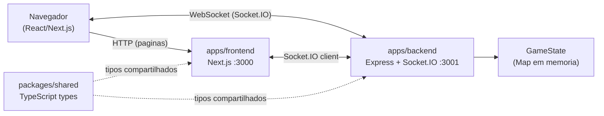

# Arquitetura do Sistema

## Diagrama



---

## Visao Geral

O Coup Online usa uma arquitetura **monorepo** com dois servicos (frontend e backend) e uma biblioteca de tipos compartilhados. A comunicacao em tempo real entre os jogadores e feita via **WebSocket** usando o Socket.IO. O estado do jogo e mantido 100% em memoria no servidor — sem banco de dados no v1.

---

## Estrutura do Monorepo

```
/
+-- apps/
|   +-- frontend/       -> Next.js, React, Tailwind CSS, Socket.IO client
|   +-- backend/        -> Express, Socket.IO, TypeScript
+-- packages/
|   +-- shared/         -> tipos TypeScript compartilhados
+-- .env.example        -> template de variaveis de ambiente
+-- railway.json        -> config de deploy do backend (Railway)
+-- vercel.json         -> config de deploy do frontend (Vercel)
+-- package.json        -> workspace root, scripts globais
```

---

## Camadas da Aplicacao

### Frontend (`apps/frontend`)

Interface do jogo em React/Next.js com Tailwind CSS. Se conecta ao backend via Socket.IO para receber atualizacoes de estado em tempo real. Serve paginas estaticas via HTTP e emite eventos de acao dos jogadores ao backend.

### Backend (`apps/backend`)

Servidor Express com Socket.IO. Gerencia salas de jogo, processa acoes dos jogadores atraves de uma FSM (maquina de estados finita) e faz broadcast do estado atualizado para todos os jogadores conectados na sala. Cada acao — como pegar renda, assassinar ou contestar — passa pela FSM antes de propagar o novo estado.

### Shared (`packages/shared`)

Biblioteca de tipos TypeScript usados tanto pelo frontend quanto pelo backend. Contem definicoes de:

- **Cartas** — tipos de influencia (Duke, Assassin, Captain, Ambassador, Contessa)
- **Estado do jogo** — `GameState`, fases da FSM, acoes pendentes
- **Eventos Socket.IO** — contratos de eventos entre cliente e servidor
- **Lobby** — tipos de sala e jogador

Ter um pacote compartilhado garante tipagem consistente e elimina desacordos de contrato entre os dois servicos.

### Estado em Memoria

O estado de cada partida e armazenado em um `Map<roomId, GameState>` na memoria do processo Node.js. Nao ha banco de dados — o estado e perdido se o servidor reiniciar. Esta e uma decisao intencional para manter a simplicidade no v1, dado que o projeto e para uso pessoal entre amigos.

---

## Comunicacao

| Canal | Protocolo | Uso |
|-------|-----------|-----|
| Navegador → Frontend | HTTP | Carregamento de paginas e assets estaticos |
| Navegador ↔ Backend | WebSocket (Socket.IO) | Estado do jogo em tempo real |
| Frontend ↔ Backend | Socket.IO client | Emissao de acoes e recepcao de estado |

O frontend envia acoes do jogador (ex: `GAME_ACTION` com tipo `income`, `coup`, `challenge`) e recebe o estado do jogo projetado especificamente para aquele jogador — as cartas ocultas dos adversarios **nao** sao enviadas ao cliente, somente o numero de influencias restantes.
